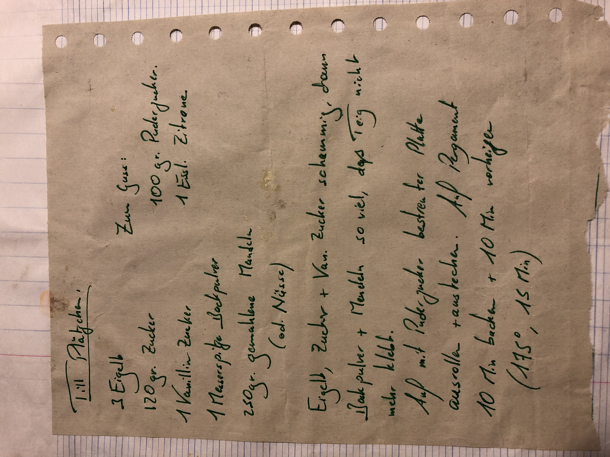
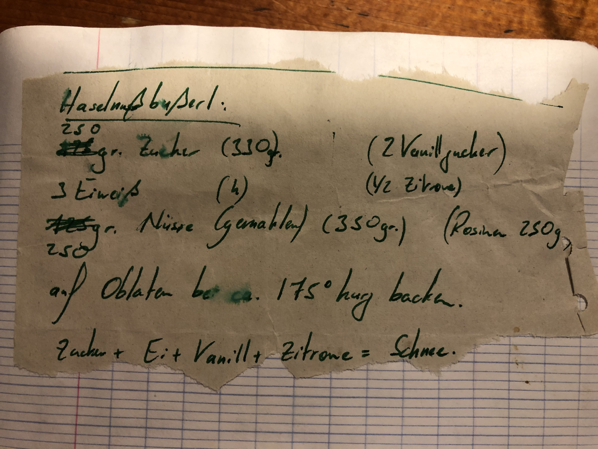

**** For our international friends, find the English recipe below. ****

Die heiligen Plätzchen-Rezepte meiner Großmutter Muini. Die PLätzchen, die sie immer für mich gebacken hatte, und die im engeren Familienkreis sogar nach mir benannt wurden 😍

Vielen Dank an Juju, der in seinem alten Kochbuch aus Schulzeiten die von mir handgeschriebenen Rezepte eingeklebt hatte und sie mir jetzt als Fotos geschickt hat 🙏

Neben der Tatsache, dass sie wahnsinnig gut schmecken und mir Muini in Erinnerung rufen, passen sie auch optimal zusammen: Die einen verarbeiten die Eigelb, die anderen die Eiweiß 😜

**Bemerkung**: Das Plätzchenfoto oben ist auch von Juju - Merci!

### Till Plätzchen

**Zutaten**

- 3 Eigelb
- 120 gr Zucker
- 1 Vanillin Zucker
- 1 Messerspitze Backpulver
- 250 gr gemahlene Mandeln (oder Nüsse)
- Für den Guss: 100 gr Puderzucker und 1 Essl. Zitrone

**Machen:** Eigelb, Zucker und Vanillin Zucker schaumig schlagen, dann Backpulver und Mandeln so viel, dass der Teig nicht mehr klebt. 

Auf mit Puderzucker bestreuter Platte ausrollen und ausstechen. Auf Pergament 10-15 Minuten backen auf 175 Grad.

### English version

**Ingredients**

- 3 egg yolks
- 120 gr sugar
- 1 vanillin sugar
- 1/2 teaspoon backing soda
- 250 gr grounded almonds (or hazelnuts)
- For the icing: 100 gr icing sugar and 1 spoon of lemon juice

**Preparation**: Mix the egg yolks, the sugar and the vanillin to a foamy structure. Then add the backing soda and the grounded nuts until the dough is not sticky anymore.

Roll out the dough on a surface covered with icing sugar and cut out the cookies. Bake them on parchment for 10-15 minutes at 175 degree.
